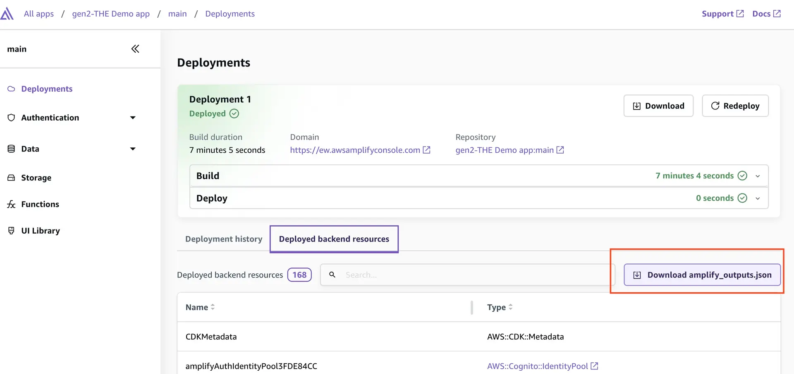

## AWS Amplify (GEN 2) React+Vite Starter TODO app

- [How Amplify works](https://docs.amplify.aws/react/how-amplify-works/concepts/)
- [Amplify React Quickstart](https://docs.amplify.aws/react/start/quickstart/)

This repository provides a starter template for creating applications using React+Vite and AWS Amplify, emphasizing easy setup for authentication, API, and database capabilities.

## Overview

This template equips you with a foundational React application integrated with AWS Amplify, streamlined for scalability and performance. It is ideal for developers looking to jumpstart their project with pre-configured AWS services like Cognito, AppSync, and DynamoDB.

## Features

- **Authentication**: Setup with Amazon Cognito for secure user authentication.
- **API**: Ready-to-use GraphQL endpoint with AWS AppSync.
- **Database**: Real-time database powered by Amazon DynamoDB.

## Set up local environment

Click on your deployed branch and you will land on the Deployments page which shows you your build history and a list of deployed backend resources.

At the bottom of the page you will see a tab for Deployed backend resources. Click on the tab and then click the Download amplify_outputs.json file button.



> **Note:** The amplify_outputs.json file contains backend endpoint information, publicly-viewable API keys, authentication flow information, and more. The Amplify client library uses this outputs file to connect to your Amplify Backend. You can review how the outputs file is imported within the main.tsx file and then passed into the Amplify.configure(...) function of the Amplify client library.

## Deploying to AWS

For detailed instructions on deploying your application, refer to the [deployment section](https://docs.amplify.aws/react/start/quickstart/#deploy-a-fullstack-app-to-aws) of our documentation.

### Deploy cloud sandbox

To update your backend without affecting the production branch, use Amplify's cloud sandbox. This feature provides a separate backend environment for each developer on a team, ideal for local development and testing.

To start your cloud sandbox, run:
```
To delete the sandbox
```

Once the cloud sandbox has been fully deployed (~5 min), you'll see the `amplify_outputs.json` file updated with connection information to a new isolated authentication and data backend.

> **Note:** The npx ampx sandbox command should run concurrently to your npm run dev. You can think of the cloud sandbox as the "localhost-equivalent for your app backend".


To delete the sandbox, run: 
```
npx ampx sandbox delete
```

## Security

See [CONTRIBUTING](CONTRIBUTING.md#security-issue-notifications) for more information.

## License

This library is licensed under the MIT-0 License. See the LICENSE file.